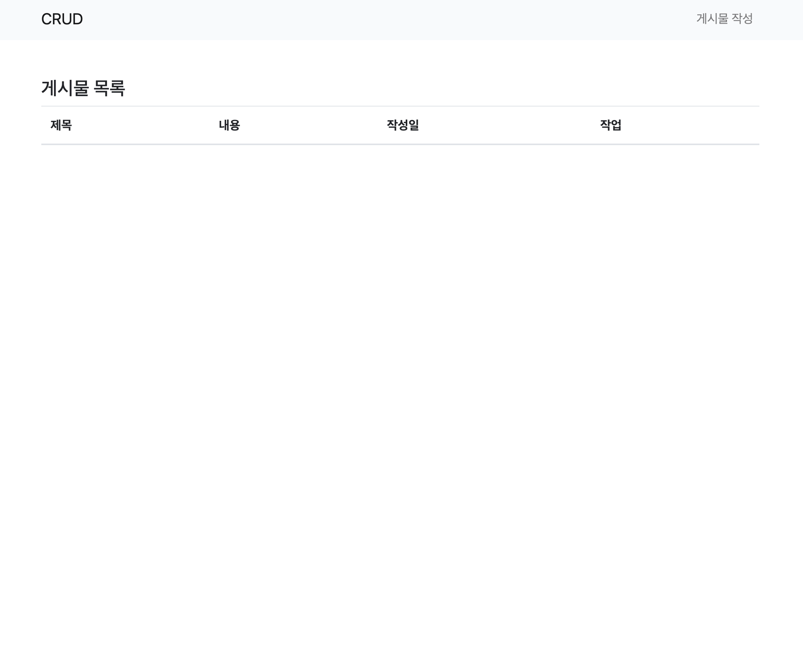

# CRUD - PHP & MySQL

## Table of contents
- [1) Introduction](#1-introduction)
- [2) Getting started](#2-getting-started)


### 1) Introduction




### 2) Getting started
1. MySQL DB Setting
`mysql -uroot -p`

``` SQL
CREATE DATABASE CRUD;
use CRUD;
CREATE TABLE posts (
    id INT AUTO_INCREMENT PRIMARY KEY,
    title VARCHAR(255) NOT NULL,
    content TEXT,
    created_at TIMESTAMP DEFAULT CURRENT_TIMESTAMP,
    updated_at TIMESTAMP DEFAULT CURRENT_TIMESTAMP ON UPDATE CURRENT_TIMESTAMP
);
```

2. `php -S localhost:[port]`
3. App should be running https://localhost:[port]


